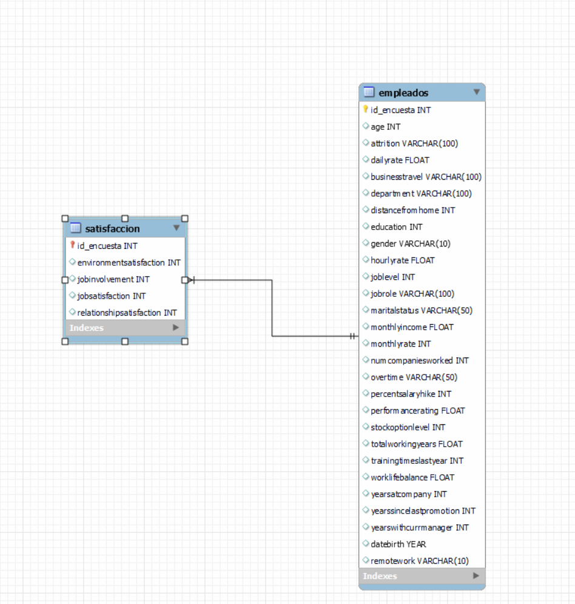

# Fuga de Cerebros 🧠
## Hera Data
### Proyecto de Análisis de Datos y Experimentación A/B para ABC Corporation

## Descripción del Proyecto
Este proyecto tiene como objetivo principal reducir la rotación de empleados y mejorar la satisfacción en el trabajo dentro de ABC Corporation, una consultora tecnológica especializada en soluciones de inteligencia artificial y aprendizaje automático. A través del análisis de datos y la experimentación A/B, buscamos identificar los factores que influyen en la satisfacción laboral y en la retención de empleados.

Para el desarrollo de este proyecto, aplicamos la metodología Agile, dividiéndolo en múltiples iteraciones cortas (sprints) de aproximadamente 1-2 semanas cada una. Durante cada sprint, el equipo se centró en completar un conjunto de tareas priorizadas en el backlog del proyecto.

**Planificación del Sprint:**
- Al inicio de cada sprint, se realizó una reunión de planificación para identificar y estimar las tareas más importantes.
- El equipo comprometió un conjunto de tareas a completar durante el sprint.

**Desarrollo Iterativo:**
- El trabajo se desarrolló de manera incremental, ajustándose según el feedback recibido al final de cada sprint.
- Las tareas incluyeron actividades como análisis de datos, construcción de modelos, y visualización de datos.

**Revisión y Retrospectiva:**
- Al final de cada sprint, se realizó una reunión de revisión para presentar resultados y recibir feedback.
- En la retrospectiva, el equipo discutió mejoras y aplicó estos aprendizajes en el siguiente sprint.

**Entrega Continua:**
- Cada sprint resultó en una versión funcional del proyecto, revisable y testeable por los usuarios.
- La flexibilidad de Agile permitió adaptarse a cambios en requisitos y prioridades, resultando en un producto final de alta calidad.

## 🚧 Estructura del Proyecto

**data/**
- `datos_empresa_final.csv`
- `datos_empresa_nonulos.csv`
- `datos_empresa_V.1.clean.csv`
- `datos_empresa_V1.1.csv`
- `datos_empresa_V1.csv`
- `datos_empresa.csv`
- `empleados.csv`
- `satisfaccion.csv`

**img/**
- `abandonos_a_b.png`
- `ABtesting.png`
- `Años en la empresa por rotación.png`
- `Edad por rotación.png`
- `genero_civil.png`
- `media_edad_renuncias.png`
- `output.png`
- `porcentaje_abandonos.png`
- `rotacion_años_empresa.png`
- `rotacion_departamento.png`
- `rotacion_empleados.png`
- `rotacion_rol_nivel.png`
- `rotacion_vida_trabajo.png`
- `satisfaccion_genero.png`
- `satisfacción_laboral_años.png`

**src/**
- `Fase5_ETL_soporte_SQL.py`
- `Fase5_ETL_soporte.py`
  
**main/**
  - `Fase_1.ipynb`
  - `Fase1_EDA.ipynb`
  - `Fase2_limpieza_funciones.ipynb`
  - `Fase2_limpieza.ipynb`
  - `Fase2_visualizaciones.ipynb`
  - `Fase3_BBDD.ipynb`
  - `Fase4_ABTesting.ipynb`
  - `Documentacion.ipynb`
  - `Fase5_ETL.py`

**README.md**

## ⚙ Requisitos

- **Python**
- **Jupyter Notebook**
- **Visual Studio Code**

## Tecnologías Utilizadas

- **Python:** Para análisis de datos y desarrollo de funciones ETL.
- **Pandas:** Para manejo y manipulación de datos.
- **SQL:** Para creación e interacción con la base de datos.
- **Matplotlib/Seaborn:** Para visualización de datos.

## 🛠 Instalación

1. **Instalar Python:**
   - Descargar e instalar Python desde [Python.org](https://www.python.org/).
   - Asegúrate de marcar la opción para agregar Python a tu PATH durante la instalación.

2. **Instalar Jupyter Notebook:**
   - Abre una terminal o símbolo del sistema y ejecuta el siguiente comando:
     ```bash
     pip install notebook
     ```

3. **Instalar Visual Studio Code:**
   - Descargar e instalar Visual Studio Code desde [Visual Studio Code](https://code.visualstudio.com/).

4. **Instalar Extensiones de Visual Studio Code:**
   - Abre Visual Studio Code.
   - Ve a la vista de Extensiones haciendo clic en el ícono cuadrado en la barra lateral o presionando `Ctrl+Shift+X`.
   - Busca e instala las siguientes extensiones:
     - **Python** (de Microsoft)
     - **Jupyter** (de Microsoft)

## Fases en las que se desarrolló el proyecto

1. **Análisis Exploratorio de Datos (EDA):**
   - Exploración del conjunto de datos para familiarizarse con ellos y entender su estructura.
   - Ejecuta el archivo `Fase_1.ipynb` para ver los resultados del análisis.

2. **Transformación de Datos:**
   - Limpieza y transformación del conjunto de datos.
   - Ejecuta los archivos `Fase2_limpieza.ipynb` y `Fase2_visualizaciones.ipynb` para ver los resultados.

3. **Diseño de Base de Datos e Inserción de Datos:**
   - Creación de la estructura de la base de datos y carga de los datos iniciales.
   - Ejecuta el archivo `Fase3_BBDD.ipynb` para ver los resultados obtenidos.
   - 

4. **Experimentación A/B:**
   - Prueba de hipótesis relacionada con la satisfacción laboral y la rotación de empleados.
   - Ejecuta el archivo `Fase4_ABTesting.ipynb` para ver los resultados.
   - 

5. **Creación de una ETL:**
   - Automatización del proceso de extracción, transformación y carga de datos.
   - Ejecuta el archivo `Fase5_ETL.py` para ver los resultados.

## Conclusiones 📑

ABC Corporation presenta una tasa de rotación del 16%, significativamente inferior al 27% observado en otras empresas del sector. Para entender mejor esta diferencia, segmentamos a los empleados en dos grupos basados en su nivel de satisfacción. Observamos que roles como "Representantes de ventas" y "Técnico de laboratorio" tienen una rotación significativamente mayor, posiblemente debido a la naturaleza competitiva de estos puestos o las condiciones del mercado laboral. Además, la rotación es más alta en los niveles jerárquicos más bajos, lo que podría reflejar menor satisfacción o limitadas oportunidades de crecimiento. Estos hallazgos subrayan la necesidad de implementar estrategias diferenciadas por rol y nivel jerárquico, para retener talento crítico y reducir la rotación en áreas clave.

Examinamos la tendencia de rotación en función de los años de antigüedad en la empresa. Dos patrones importantes emergen: una alta rotación durante los primeros 0-5 años de empleo, y picos significativos en torno a los 20 y 40 años de antigüedad. Estos resultados destacan la importancia de optimizar el proceso de onboarding y fomentar el desarrollo profesional continuo.

## Contacto

Para más información o preguntas sobre el proyecto, contacta al equipo a través del repositorio de GitHub:
- [laural87](https://github.com/laural87)
- [Bea](https://github.com/BeaDataArtist)
- [Bertha_Karolina](https://github.com/910129023)

## Agradecimientos

Agradecemos a ABC Corporation por confiar en nuestro equipo y brindarnos la oportunidad de contribuir a la mejora de la satisfacción y retención de empleados. ¡Esperamos que este informe sea útil y conduzca a decisiones estratégicas que impulsen el éxito a largo plazo de ABC Corporation!
